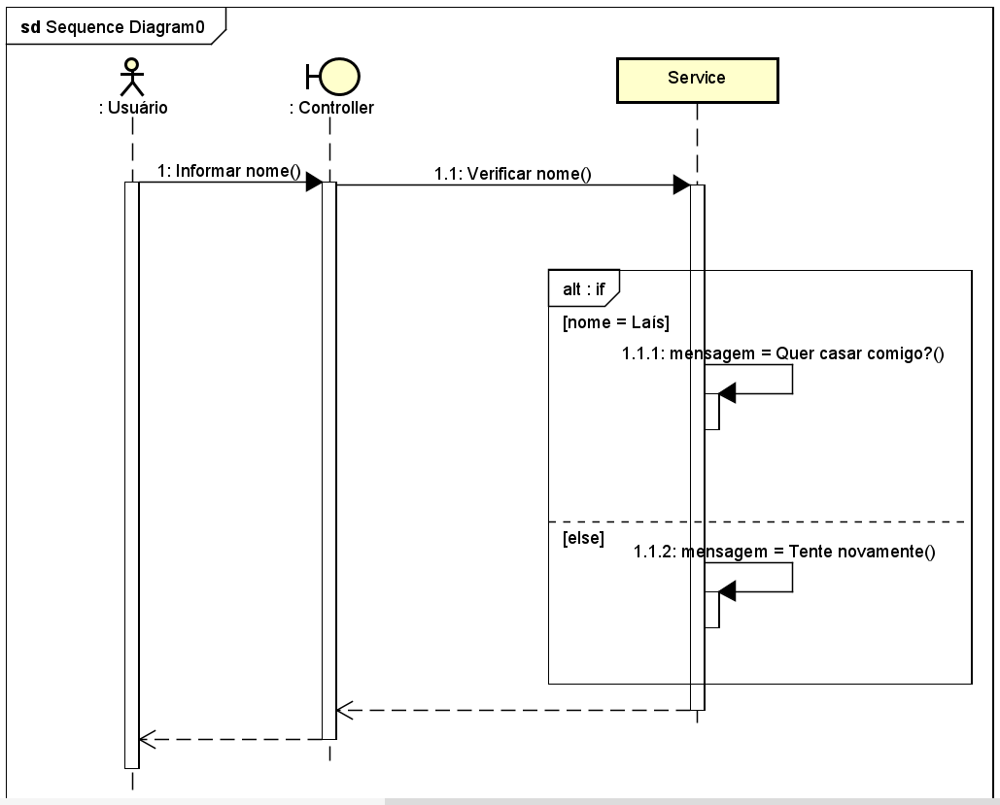
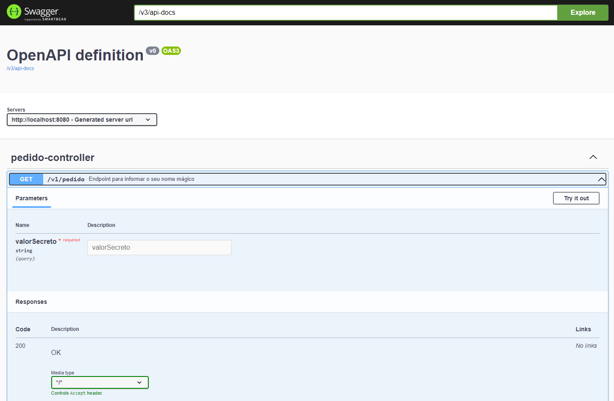

# Análise de Sistemas

### Diagramas UML para sistema Pedido de Casamento:

* Diagrama de Casos de Uso

* Diagrama de Sequência

---

# Desenvolvimento de Sistemas

### Docker: build, run e deploy na cloud Render

* Após inclusão do Dockerfile, buildar da seguinte forma: docker build -t pedido .
* Posteriormente, executar sob o seguinte comando: docker run -p 8080:8080 pedido
* Assim que os testes na local resultarem em sucesso, foi realizado o deploy do sistema sob cloud Render, conectando este repo.
